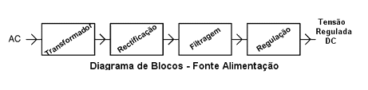
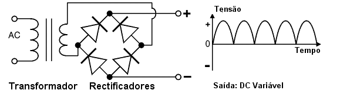

# Objetivo
Neste projeto para a disciplina de eletrônica para a computação da USP são carlos o grupo tem como objetivo projetar uma **fonte de Tensão ajustável entre 3V a 12V com capacidade de 100mA**.

# Circuíto no Falstad

Link: https://tinyurl.com/yeagkzrp

# PCB  no EAGLE

# Funcionamento:
O objetivo da fonte de alimentação é transformar a tensão do fornecedor de energia 110V-220V em
corrente alternada AC numa tensão de corrente contínua que permita os equipamentos em CC funcionar.

 **Transformador** : Transforma a tensão AC e corrente de entrada para um valor utilizável em AC.
 
 **Ponte retificadora**: Retifica os pulsos de modo a produzir uma saída polarizada DC.
 
 **Filtragem**: Filtra a tensão tornando a corrente contínua.
 
 **Regulação**: Regula a saída de modo a ter uma tensão constante.
 
 ## Etapas
 
 1. Tudo começa com a entrada de um sinal elétrico alternado, sua ddp é reduzida 
por um transformador que é um dispositivo elétrico muito comum em equipamentos eletrônicos. Ele
é capaz de “reduzir” ou “elevar” os níveis de tensão na entrada da fonte e por isso, é essencial que se
tenha um transformador de qualidade para garantir uma fonte estável.
 
 

2. O próximo estágio é a retificação dessa energia alternada para um sinal contínuo. Essa etapa é
composta por uma ponte de diodos que só permitem a passagem dos semi ciclos positivos do sinal
original, sendo essa configuração conhecida como retificador de onda completa.
Existe também o retificador de meia onda que permite a passagem de pulsos com intervalos; porém, normalmente é
utilizada em uma fonte um retificador de onda completa. Este retificador normalmente é composto
por diodos semicondutores que quando polarizados inversamente, atuam como uma chave aberta, e
quando polarizados corretamente, permitem a passagem apenas do semi ciclo positivo.

3. Na terceira parte, temos um filtro que normalmente na eletrônica é composto por indutores e capacitores, esse filtro faz com que o sinal pulsante fique o mais próximo possível de um sinal linear
de corrente contínua. Esse filtro atua carregando e descarregando os capacitores (acumuladores de
energia) como podemos ver na imagem abaixo:

O capacitor se carrega durante um breve período de tempo e tem sua descarga lenta, com isso, faz
com que os pulsos de saída fiquem quase invisíveis. Esse ruído residual é conhecido como RIPPLE e
quanto menor o RIPPLE, melhor é a fonte de alimentação.

4. A última etapa da fonte, mas não menos importante que as antecedentes, é a regulação. Um regulador é um dispositivo que funciona de forma a linearizar o máximo possível a saída da fonte na tensão desejada. Ou seja, por mais que entre uma tensão pulsante e maior que a desejada na entrada do regulador, este deve
apresentar em sua saída um valor constante fixo, e aguentar também variações na corrente da carga e na temperatura. Para fontes de alimentação de baixa corrente, um regulador de tensão simples pode ser feito com um resistor e um diodo zener conectado ao contrário, conforme mostrado no diagrama. Os diodos Zener são classificados por sua tensão de ruptura e potência máxima, sendo 13 V e 0,5 W os valores escolhidos para o trabalho, o resistor tem a função de limitar a corrente que passará pelo zener. Como desejamos uma fonte de tensão variavel, 3V A 12V, o potenciometro tem a função de controlar esta tensão através da queda de potencial conforme o valor de saída requerido.

## Cálculos

A **voltagem de pico** é um valor que será usado nos próximos cálculos e consiste na medida a partir do eixo horizontal até a parte superior da onda.
Para obtermos este valor, basta multiplicarmos a tensão rms pela raiz de 2

  

A **Razão do transformador** será calculada e depois subtraída 1,4V que serão perdidos na ponte de diodos, uma vez que cada diodo consome 0,7V da tensão.
considerando que desejamos trbalhar com a ddp de 24V, podemos realizar os seguintes cálculos:

Com a tensão entre os polos da ponte de diodos, podemos calcular o **Valor do ripple**, que consiste em 10% da voltagem que chega ao capacitor, e com esse valor,
futuramente poderemos calcular a Capacitância necessária para este capacitor, além de podermos calcular a tensão de saída deste capacitor:

  

  
  
  
  # Valores 
  
  | Quantidade | Componente | Valor uni. | Valor Tot|
|--------------|------------|-------|--------|
| 1 | Transformador 110/220V para 24V| [38,77](https://www.baudaeletronica.com.br/transformador-trafo-1a-24v.html)| 38,77 |
| 4 | Diodo Retificador 10A10| [0,95](https://www.baudaeletronica.com.br/diodo-10a10.html ) | 3,80 |
| 1 | Capacitor 470 uF /25V| [0,41](https://www.baudaeletronica.com.br/capacitor-eletrolitico-470uf-25v.html) | 0,41|
| 1 | Diodo Zener 13V | [0,09](https://www.baudaeletronica.com.br/diodo-zener-bzx55c-13v-0-5w.html) | 0,09 |
| 1 | Resistor 1K | [0,06](https://www.baudaeletronica.com.br/resistor-1k-5-1-4w.html)| 0,06 |  
| 1 | Resistor 1.8K | [0,14](https://www.baudaeletronica.com.br/resistor-1k8-1-2w.html)| 0,14 |
| 1 | Resistor 2K | [0,06](https://www.baudaeletronica.com.br/resistor-2k-5-1-4w.html)| 0,06 |    
| 1 | Transistor NPN | [0,22](https://www.baudaeletronica.com.br/transistor-npn-bc337.html)| 0,22 |
| 1 | Potenciômetro 5K | [2,20](https://www.baudaeletronica.com.br/potenciometro-linear-de-5k-5000.html)| 2,20 |
| 1 | Led 5mm Vermelho| [0,25](https://www.baudaeletronica.com.br/led-difuso-5mm-vermelho.html)| 0,25 |
|**Total:** | | | **R$ 46,00**|

  
 
  
  # Responsáveis
  Felipe Henrique de Oliveira - 11272811
 Lucas -
 Rogério -
  

